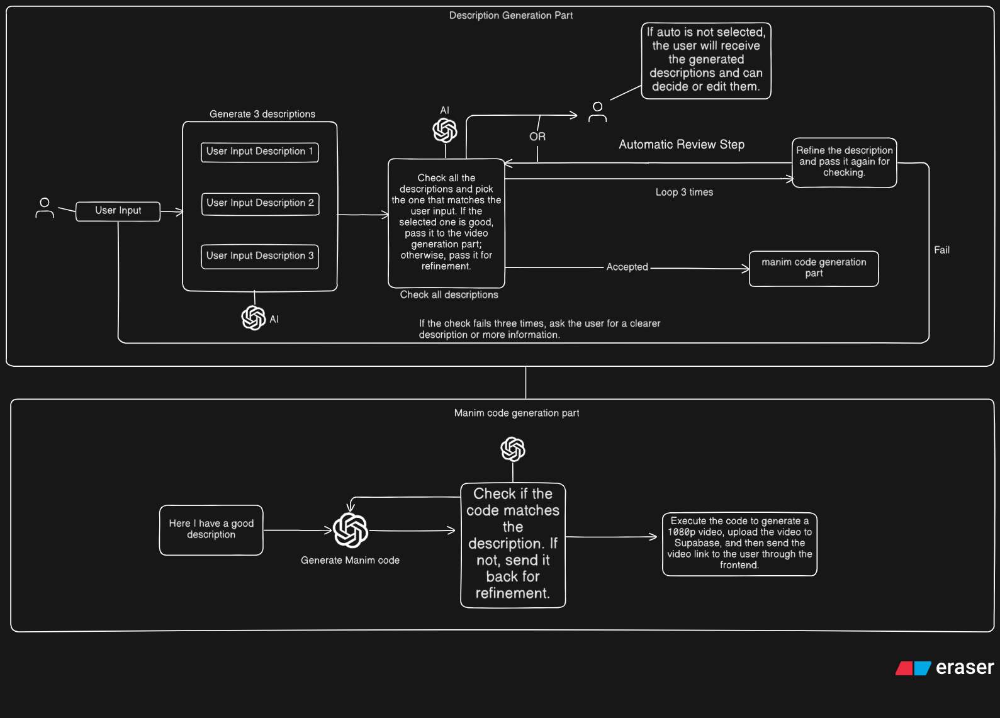

# AI-Powered Manim Video Generator

An intelligent pipeline that transforms simple text prompts into high-quality, 1080p animated videos using the Manim engine and generative AI.

This project automates the complex process of creating mathematical animations. It takes a user's initial idea, refines it through an AI-powered validation loop to create a detailed script, generates the corresponding Python code for Manim, and renders the final video.

## 🎬 Demo

Animation Generation Process


Check out these examples of AI-generated Manim animations:

**Surface 1 Prompt:** Create a 3D surface plot of the function z = sin(x) * cos(y) using a grid. Animate the camera zooming in and rotating around the surface.

**Surface 2 Prompt:** Show a 3D surface plot for sin(x) + cos(y)

| Surface 1 | Surface 2 |
|--------------|--------------|
| <br>3D Surface: sin(x) * cos(y) | <br>3D Surface: sin(x) + cos(y) |


## ✨ Key Features

- **AI Script Generation**: Automatically expands a user's idea into multiple detailed scene descriptions.
- **Iterative Refinement**: A multi-step validation system ensures the script is high-quality and accurate before generating code.
- **Text-to-Code**: Converts the final, approved description into an executable Manim Python script.
- **End-to-End Automation**: Handles video rendering, uploading to cloud storage (Supabase), and delivering a shareable link to the user.
- **User-in-the-Loop**: While highly automated, the pipeline allows for optional user intervention to review and edit descriptions, ensuring the final output perfectly matches their vision.

## ⚙️ Architecture and Workflow

The project is built around a two-stage pipeline: **Description Generation** and **Manim Code Generation**.




### Part 1: Description Generation

The goal of this stage is to convert a vague user idea into a precise, machine-readable description suitable for code generation.

1.  **User Input**: The process starts with a simple text description from the user.
2.  **Query Validation**: An AI agent checks whether the user's query is possible and feasible to create as a Manim animation.
3.  **AI Expansion**: If the query is valid, the AI generates a detailed description based on the user's vague input.
4.  **Description Validation & Refinement Loop**:
    - An AI agent checks if the detailed query is correct, complete, and matches the user's query.
    - If the description needs improvement, it enters a refinement loop (maximum 3 times) where the AI rewrites and improves the detailed description.
    - After each refinement, the description is checked again for quality and accuracy.
5.  **Acceptance or Failure**:
    - If the description passes validation, it is marked as "Accepted" and proceeds to the Manim generation part.
    - If the check fails three times, the system asks the user for a clearer description or more information (Fail Case).
6.  **Output**: The accepted detailed description is passed to the next stage for code generation.

### Part 2: Manim Code & Video Generation

This stage takes the approved description and handles all technical aspects of creating the video.

1.  **AI Code Generation**: The passed detailed description is used to a generative AI model that writes the Python code required to create the animation using the Manim library.
2.  **Code Validation**: The generated code is checked to ensure it accurately implements the description. If it doesn't match, it is sent back for refinement.
3.  **Execution & Rendering**: The final, validated code is executed. Manim renders the animation into a 720p MP4 video file, but you can change the format and video or GIF quality using the Quality button.
4.  **Storage & Delivery**: The video is automatically uploaded to a Supabase storage bucket, and a public link to the video is sent back to the user through the frontend.

## 🛠️ Technology Stack

-   **Core Animation Engine**:
    -   [Manim](https://www.manim.community/)

-   **Backend**:
    -   [Python](https://www.python.org/)
    -   [FastAPI](https://fastapi.tiangolo.com/) for the web server
    -   [Pydantic](https://pydantic.dev/) for data validation

-   **AI & Orchestration**:
    -   [LangChain](https://www.langchain.com/) & [LangGraph](https://langchain-ai.github.io/langgraph/) for building the agentic pipeline
    -   [LangSmith](https://www.langchain.com/langsmith) for debugging and observability
    -   Generative AI Models (e.g., GPT, Gemini)

-   **Frontend**:
    -   [React](https://react.dev/)
    -   [Material-UI (MUI)](https://mui.com/) for UI components

-   **Database & Storage**:
    -   [PostgreSQL](https://www.postgresql.org/)
    -   [Supabase](https://supabase.io/) for video storage and delivery

## 🚀 Getting Started

Follow these instructions to run the project locally using Docker.

### Prerequisites

- [Docker](https://www.docker.com/get-started) and Docker Compose installed on your machine
- API keys for:
  - Google Generative AI (Gemini)
  - LangSmith (optional, for debugging)
  - Supabase (for video storage)
  - MongoDB (for database)
  - Redis (for Celery task queue)

### Installation & Setup

1.  **Clone the repository**
    ```sh
    git clone https://github.com/SurajPatel04/manimVideoGenerate.git
    cd manimVideoGenerate
    ```

2.  **Configure environment variables**
    
    Copy the `.env.template` file to `.env` and fill in your actual values:
    ```sh
    cp .env.template .env
    ```
    
    Edit the `.env` file and replace all `<YOUR_VALUE>` placeholders with your actual credentials.

3.  **Run with Docker Compose**
    
    Build and start all services (backend, frontend, and Celery worker):
    ```sh
    sudo docker compose -f docker-compose.yml up
    ```
    
    Or to run in detached mode (background):
    ```sh
    sudo docker compose -f docker-compose.yml up -d
    ```

4.  **Access the application**
    - **Frontend**: Open [http://localhost:3000](http://localhost:3000) in your browser
    - **Backend API**: [http://localhost:8000](http://localhost:8000)
    - **API Documentation**: [http://localhost:8000/docs](http://localhost:8000/docs)

5.  **Stop the application**
    ```sh
    sudo docker compose down
    ```