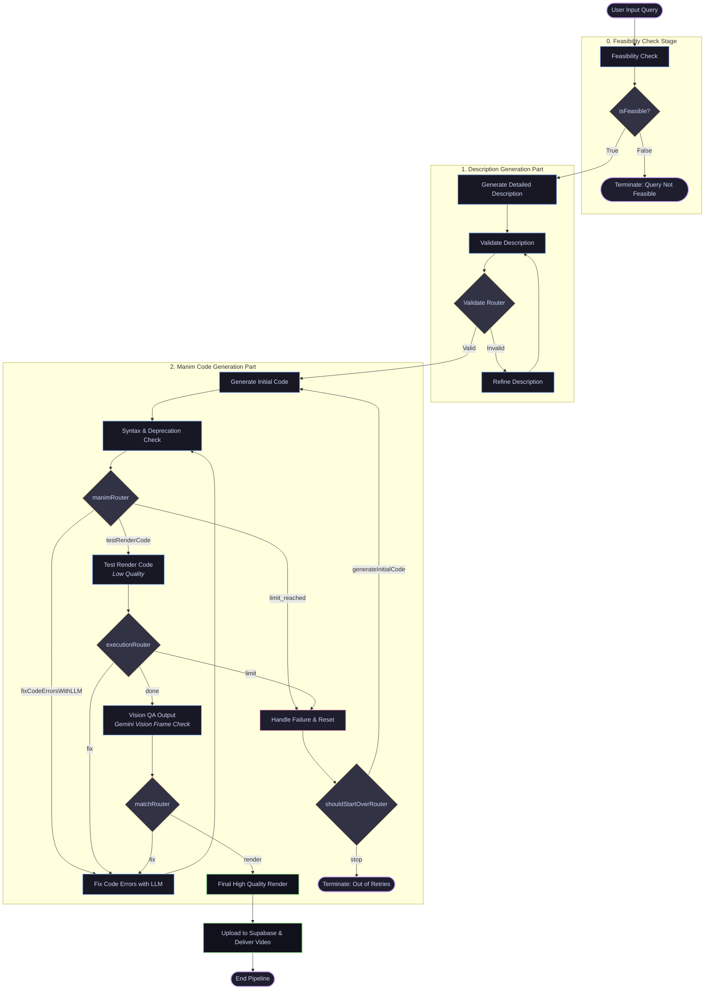

# AI-Powered Manim Video Generator

An intelligent pipeline that transforms simple text prompts into high-quality, 1080p animated videos using the Manim engine and generative AI.

This project automates the complex process of creating mathematical animations. It takes a user's initial idea, refines it through an AI-powered validation loop to create a detailed script, generates the corresponding Python code for Manim, and renders the final video.

## 🎬 Demo

Animation Generation Process


Check out these examples of AI-generated Manim animations:

**Surface 1 Prompt:** Create a 3D surface plot of the function z = sin(x) * cos(y) using a grid. Animate the camera zooming in and rotating around the surface.

**Surface 2 Prompt:** Show a 3D surface plot for sin(x) + cos(y)

| Surface 1 | Surface 2 |
|--------------|--------------|
| <br>3D Surface: sin(x) * cos(y) | <br>3D Surface: sin(x) + cos(y) |


## ✨ Key Features

- **AI Script Generation**: Automatically expands a user's idea into multiple detailed scene descriptions.
- **Iterative Refinement**: A multi-step validation system ensures the script is high-quality and accurate before generating code.
- **Text-to-Code**: Converts the final, approved description into an executable Manim Python script.
- **Vision-Based Quality Assurance**: Extracts final frames from rendered videos and uses vision-language models (e.g., GPT-4o-mini, Gemini 1.5 Flash) to visually guarantee the animation correctly matches the user's intent.
- **End-to-End Automation**: Handles video rendering, uploading to cloud storage (Supabase), and delivering a shareable link to the user.
- **User-in-the-Loop**: While highly automated, the pipeline allows for optional user intervention to review and edit descriptions, ensuring the final output perfectly matches their vision.
- **User Management & Authentication**: Secure Google OAuth and JWT-based authentication system, complete with email verification and password reset workflows.
- **Generation History**: Automatically saves user prompts and generated video links to a personal dashboard using MongoDB.

## ⚙️ Architecture and Workflow

The project is built around a three-stage pipeline: **Feasibility Check**, **Description Generation**, and **Manim Code Generation** with self-healing loops.


```mermaid
flowchart TD
    %% Styling Definitions
    classDef startEnd fill:#1e1e2e,stroke:#cba6f7,stroke-width:2px,color:#cdd6f4;
    classDef process fill:#181825,stroke:#89b4fa,stroke-width:1.5px,color:#cdd6f4;
    classDef router fill:#313244,stroke:#f9e2af,stroke-width:1.5px,color:#cdd6f4;
    classDef action fill:#11111b,stroke:#a6e3a1,stroke-width:2px,color:#cdd6f4;
    classDef failNode fill:#1e1e2e,stroke:#f38ba8,stroke-width:1.5px,color:#cdd6f4;

    %% Global Entry
    START([User Input Query]) --> Stage0[Feasibility Check]

    %% 0. FEASIBILITY CHECK
    subgraph "0. Feasibility Check Stage"
        Stage0 --> RouteFeas{isFeasible?}
        RouteFeas -- False --> TerminateFail([Terminate: Query Not Feasible])
    end

    %% Connection to Description Gen
    RouteFeas -- True --> Stage1_Init[Generate Detailed Description]

    %% 1. DESCRIPTION GENERATION PIPELINE
    subgraph "1. Description Generation Part"
        Stage1_Init --> Stage1_Val[Validate Description]
        Stage1_Val --> RouteDesc{Validate Router}
        RouteDesc -- Invalid --> Stage1_Ref[Refine Description]
        Stage1_Ref --> Stage1_Val
    end

    %% Connection to Code Gen
    RouteDesc -- Valid --> Stage2_Init[Generate Initial Code]

    %% 2. MANIM CODE GENERATION PIPELINE (Self-Healing)
    subgraph "2. Manim Code Generation Part"
        Stage2_Init --> Stage2_Static[Syntax & Deprecation Check]
        
        Stage2_Static --> RouterManim{manimRouter}
        
        %% Static Routing
        RouterManim -- fixCodeErrorsWithLLM --> Stage2_Fix[Fix Code Errors with LLM]
        RouterManim -- testRenderCode --> Stage2_Test[Test Render Code <br/><i>Low Quality</i>]
        RouterManim -- limit_reached --> Stage2_Reset[Handle Failure & Reset]

        %% Test Render Routing
        Stage2_Test --> RouterExec{executionRouter}
        RouterExec -- fix --> Stage2_Fix
        RouterExec -- done --> Stage2_Vision[Vision QA Output <br/><i>Gemini Vision Frame Check</i>]
        RouterExec -- limit --> Stage2_Reset

        %% Vision Routing
        Stage2_Vision --> RouterMatch{matchRouter}
        RouterMatch -- fix --> Stage2_Fix
        RouterMatch -- render --> Stage2_Prod[Final High Quality Render]

        %% Debug Loop back to checks
        Stage2_Fix --> Stage2_Static

        %% Start Over Logic
        Stage2_Reset --> RouterReset{shouldStartOverRouter}
        RouterReset -- generateInitialCode --> Stage2_Init
        RouterReset -- stop --> TerminateLimit([Terminate: Out of Retries])
    end

    %% Final Upload
    Stage2_Prod --> Upload[Upload to Supabase & Deliver Video] --> END([End Pipeline])

    %% Apply Styles
    class START,END,TerminateFail,TerminateLimit startEnd;
    class Stage0,Stage1_Init,Stage1_Val,Stage1_Ref,Stage2_Init,Stage2_Static,Stage2_Test,Stage2_Vision,Stage2_Fix process;
    class RouteFeas,RouteDesc,RouterManim,RouterExec,RouterMatch,RouterReset router;
    class Stage2_Prod,Upload action;
    class Stage2_Reset failNode;
```


### Part 1: Description Generation

The goal of this stage is to convert a vague user idea into a precise, machine-readable description suitable for code generation.

1.  **User Input**: The process starts with a simple text description from the user.
2.  **Query Validation**: An AI agent checks whether the user's query is possible and feasible to create as a Manim animation.
3.  **AI Expansion**: If the query is valid, the AI generates a detailed description based on the user's vague input.
4.  **Description Validation & Refinement Loop**:
    - An AI agent checks if the detailed query is correct, complete, and matches the user's query.
    - If the description needs improvement, it enters a refinement loop (maximum 3 times) where the AI rewrites and improves the detailed description.
    - After each refinement, the description is checked again for quality and accuracy.
5.  **Acceptance or Failure**:
    - If the description passes validation, it is marked as "Accepted" and proceeds to the Manim generation part.
    - If the check fails three times, the system asks the user for a clearer description or more information (Fail Case).
6.  **Output**: The accepted detailed description is passed to the next stage for code generation.

### Part 2: Manim Code & Video Generation

This stage takes the approved description and handles all technical aspects of creating the video asynchronously.

1.  **Task Queuing**: The video generation request is enqueued as a background task via **Celery** and **Redis**, providing the user with a task ID to avoid blocking the API server and allowing real-time status polling.
2.  **AI Code Generation**: The passed detailed description is used to a generative AI model that writes the Python code required to create the animation using the Manim library.
3.  **Code Validation & Vision QA**: The generated code is checked to ensure it accurately implements the description without syntax errors. After a dry-run render, a Vision LLM (like GPT-4o-mini) inspects the final frames of the video to guarantee it visually matches the core request. If it fails visually or syntactically, the code is sent back for AI refinement.
4.  **Execution & Rendering**: The final, validated code is executed. Manim renders the animation into a high-quality MP4 video file. Users can customize the format and quality via the UI. Users also have the ability to cancel in-flight generation tasks.
5.  **Storage & Delivery**: The video is automatically uploaded to a Supabase storage bucket, and a public link to the video is sent back to the user through the frontend.

## 🛠️ Technology Stack

-   **Core Animation Engine**:
    -   [Manim](https://www.manim.community/)

-   **Backend**:
    -   [Python](https://www.python.org/)
    -   [FastAPI](https://fastapi.tiangolo.com/) for the web server
    -   [Pydantic](https://pydantic.dev/) for data validation

-   **AI & Orchestration**:
    -   [LangChain](https://www.langchain.com/) & [LangGraph](https://langchain-ai.github.io/langgraph/) for building the agentic pipeline
    -   [LangSmith](https://www.langchain.com/langsmith) for debugging and observability
    -   Generative AI Models (Google Gemini 1.5 Pro/Flash, OpenAI GPT-4o-mini)

-   **Frontend**:
    -   [React](https://react.dev/) powered by [Vite](https://vitejs.dev/)
    -   [Tailwind CSS](https://tailwindcss.com/) for core styling
    -   [Material-UI (MUI)](https://mui.com/) for UI components
    -   [Framer Motion](https://www.framer.com/motion/) for fluid animations

-   **Database & Storage**:
    -   [MongoDB](https://www.mongodb.com/) for primary database (users, history)
    -   [Redis](https://redis.io/) for caching and Celery task queuing
    -   [Supabase](https://supabase.io/) for video storage and delivery

## 🚀 Getting Started

Follow these instructions to run the project locally using Docker.

### Prerequisites

- [Docker](https://www.docker.com/get-started) and Docker Compose installed on your machine
- API keys for:
  - Google Generative AI (Gemini)
  - OpenAI (for Vision QA)
  - LangSmith (optional, for debugging)
  - Supabase (for video storage)
  - MongoDB (for database)
  - Redis (for Celery task queue)

### Installation & Setup

1.  **Clone the repository**
    ```sh
    git clone https://github.com/SurajPatel04/manimVideoGenerate.git
    cd manimVideoGenerate
    ```

2.  **Configure environment variables**
    
    Copy the `.env.template` file to `.env` and fill in your actual values:
    ```sh
    cp .env.template .env
    ```
    
    Edit the `.env` file and replace all `<YOUR_VALUE>` placeholders with your actual credentials.

3.  **Configure TexLive (Optional - Size Optimization)**

    > ⚠️ **Important Note on TexLive:**  
    > The backend Docker image installs TeX Live packages for rendering math text. By default, it uses a **curated list of lighter packages** (`texlive`, `texlive-latex-extra`, `texlive-latex-recommended`, `texlive-fonts-recommended`, `texlive-science`) which keeps the image size optimized at **~2 GB** instead of the bloated 7+ GB.
    >
    > **Option A: Optimized Setup (Default)**
    > No changes needed. The default `backend/Dockerfile` already uses this optimized setup.
    >
    > **Option B: Multi-Language support (requires TexLive Full)**
    > If you need support for multi-language scripts (e.g., Hindi, Devanagari, Arabic, Chinese), edit `backend/Dockerfile` and replace the light packages with `texlive-full`:
    > ```dockerfile
    > RUN apt-get update && \
    >     apt-get install -y --no-install-recommends \
    >         texlive-full \
    >         dvisvgm \
    >         dvipng \
    >         ...
    > ```
    > *Note: This will download an additional 4.5+ GB during the Docker build process.*

4.  **Run with Docker Compose**
    
    Build and start all services (backend, frontend, and Celery worker):
    ```sh
    sudo docker compose -f docker-compose.yml up
    ```
    
    Or to run in detached mode (background):
    ```sh
    sudo docker compose -f docker-compose.yml up -d
    ```

5.  **Access the application**
    - **Frontend**: Open [http://localhost:3000](http://localhost:3000) in your browser
    - **Backend API**: [http://localhost:8000](http://localhost:8000)
    - **API Documentation**: [http://localhost:8000/docs](http://localhost:8000/docs)

6.  **Stop the application**
    ```sh
    sudo docker compose down
    ```